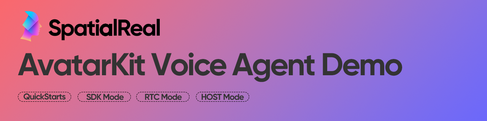

<!--BEGIN_BANNER_IMAGE-->
<p align="center">
  <picture>
    <source media="(prefers-color-scheme: dark)" srcset="./assets/banner.png">
    <source media="(prefers-color-scheme: light)" srcset="./assets/banner.png">
    
  </picture>
</p>
<!--END_BANNER_IMAGE-->

<p align="center">
  <a href="https://www.npmjs.com/package/@spatialwalk/avatarkit"></a>
  <a href="https://central.sonatype.com/artifact/ai.spatialwalk/avatarkit"></a>
  <a href="https://pub.dev/packages/avatar_kit"></a>
  <br/>
  <a href="#license"></a>
  <a href="https://discord.com/invite/dRSUTdPCjm"></a>
  <a href="https://docs.spatialreal.ai/"></a>
</p>

<p align="center">
  A collection of demo projects showing how to integrate <a href="https://docs.spatialreal.ai/">AvatarKit</a> into voice agent applications.<br/>
  Multiple integration modes · Multi-platform clients · Production-ready pipelines
</p>

---

<table>
  <tr>
    <td rowspan="2" width="66%">
      
      <p align="center"><b>Speaking</b></p>
    </td>
    <td width="34%">
      
      <p align="center"><b>Listening</b></p>
    </td>
  </tr>
  <tr>
    <td>
      
      <p align="center"><b>Idle</b></p>
    </td>
  </tr>
</table>

## Features

- **End-to-end examples** — Each demo is self-contained with frontend, backend, and environment config
- **Multiple architectures** — Client-side SDK, server-side Host pipeline, and RTC-based agent frameworks
- **Multi-provider backends** — Swap between OpenAI, Google Gemini, Deepgram, Cartesia, Azure, AWS, and more
- **Cross-platform** — Web (React, Vue, Vanilla JS, Next.js), iOS, Android, and Flutter

## AvatarKit SDKs

<table>
  <tr>
    <th>Platform</th>
    <th>Package</th>
    <th>Links</th>
  </tr>
  <tr>
    <td><b>Web</b></td>
    <td><code>@spatialwalk/avatarkit</code></td>
    <td><a href="https://www.npmjs.com/package/@spatialwalk/avatarkit">npm</a> · <a href="https://docs.spatialreal.ai/">docs</a></td>
  </tr>
  <tr>
    <td><b>Android</b></td>
    <td><code>ai.spatialwalk:avatarkit</code></td>
    <td><a href="https://central.sonatype.com/artifact/ai.spatialwalk/avatarkit">Maven Central</a> · <a href="https://docs.spatialreal.ai/">docs</a></td>
  </tr>
  <tr>
    <td><b>iOS</b></td>
    <td><code>AvatarKit.xcframework</code></td>
    <td><a href="https://github.com/spatialwalk/AvatarKit-iOS">GitHub</a> · <a href="https://docs.spatialreal.ai/">docs</a></td>
  </tr>
  <tr>
    <td><b>Flutter</b></td>
    <td><code>avatar_kit</code></td>
    <td><a href="https://pub.dev/packages/avatar_kit">pub.dev</a> · <a href="https://docs.spatialreal.ai/">docs</a></td>
  </tr>
</table>

## Demos

> **New here?** Start with [`spatialreal-agent-quickstart`](./spatialreal-agent-quickstart) — the fastest way to get a working voice agent with a lip-synced avatar.

<table>
  <tr>
    <td width="50%">
      <h3><a href="./spatialreal-speech-to-avatar-quickstart">Speech-to-Avatar Quickstart</a></h3>
      <p><code>SDK</code> · Vue · No backend</p>
      <p>Minimal avatar + audio streaming. Stream pre-recorded PCM audio with lip-sync — no server required.</p>
    </td>
    <td width="50%">
      <h3><a href="./spatialreal-agent-quickstart">Agent Quickstart</a></h3>
      <p><code>RTC</code> · React · LiveKit Agents</p>
      <p>Fastest path to a voice agent. Gemini Live backend + AvatarKit UI components.</p>
    </td>
  </tr>
  <tr>
    <td>
      <h3><a href="./sdk-mode">SDK Mode</a></h3>
      <p><code>SDK</code> · React, Vue, Vanilla, Next.js, iOS, Android, Flutter</p>
      <p>Client-side conversation pipeline. Direct WebSocket to SpatialReal — multi-platform reference implementations.</p>
    </td>
    <td>
      <h3><a href="./livekit-agents">LiveKit Agents</a></h3>
      <p><code>RTC</code> · React, Next.js · Cascade / End-to-End</p>
      <p>Full-featured voice agent pipeline. Multi-provider support: OpenAI, Deepgram, Cartesia, Azure, and more.</p>
    </td>
  </tr>
  <tr>
    <td>
      <h3><a href="./rtc-mode">RTC Mode</a></h3>
      <p><code>RTC</code> · React · Token only</p>
      <p>RTC connectivity validation. Verify LiveKit + SpatialReal room setup.</p>
    </td>
    <td>
      <h3><a href="./host-mode">Host Mode</a></h3>
      <p><code>Host</code> · React, Vue, Vanilla, Next.js, iOS, Android, Flutter</p>
      <p>Full server-side pipeline (ASR → LLM → TTS). Multi-platform clients with config check and one-command setup.</p>
    </td>
  </tr>
</table>

## Quick Start

The fastest way to run a voice agent with a lip-synced avatar:

```bash
git clone https://github.com/spatialwalk/avatarkit-voice-agent-demo.git
cd avatarkit-voice-agent-demo/spatialreal-agent-quickstart

# Set up environment variables
cp backend/.env.example backend/.env
cp frontend/.env.example frontend/.env
# Fill both .env files with your credentials
```

Then open three terminals:

```bash
# Terminal 1 — Token server
cd backend && uv sync && uv run token_server.py

# Terminal 2 — Agent worker
cd backend && uv run agent.py dev

# Terminal 3 — Frontend
cd frontend && pnpm install && pnpm dev
```

Open `http://localhost:3000`, click **Connect**, then **Start Mic**.

## Prerequisites

| Tool | Version | |
|------|---------|---|
| Node.js | 18+ | [nodejs.org](https://nodejs.org/) |
| pnpm | latest | [pnpm.io](https://pnpm.io/) |
| Python | 3.10+ | [python.org](https://www.python.org/) |
| uv | latest | [docs.astral.sh/uv](https://docs.astral.sh/uv/) |

You will also need:

- A **SpatialReal** account — [Create one in Studio](https://app.spatialreal.ai/)
- A **LiveKit Cloud** account (or self-hosted) — [cloud.livekit.io](https://cloud.livekit.io/)
- API keys for your chosen LLM / TTS / STT providers

## Links

- [Studio](https://app.spatialreal.ai/) — Manage apps, avatars, and API keys
- [Playground](https://playground.spatialreal.ai/) — Try avatars in the browser
- [Documentation](https://docs.spatialreal.ai/) — Guides and API reference
- [Discord](https://discord.com/invite/dRSUTdPCjm) — Community & support

## License

MIT
