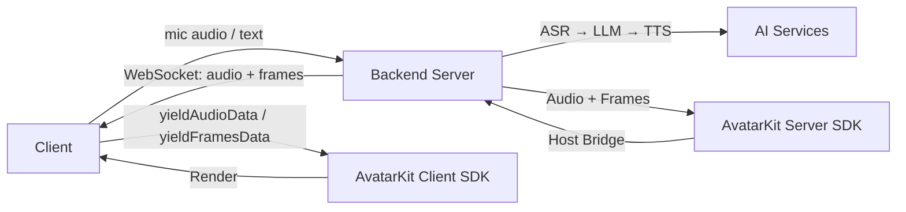

# Host Mode

[](https://www.npmjs.com/package/@spatialwalk/avatarkit)
[](https://github.com/spatialwalk/avatar-sdk-python)

## When to use Host Mode

Host Mode is for scenarios where **the backend handles the entire conversation pipeline** — ASR, LLM, TTS, and avatar animation are all processed server-side. Clients are thin: they capture audio input, send it to the backend via WebSocket, and render the avatar with the returned audio + animation data.

**Choose Host Mode when:**
- You want a turnkey server-side pipeline
- You want to keep all API keys and AI logic on the server
- You need to support thin clients (mobile, embedded) that only capture input and render
- You want centralized control over the conversation flow

**Choose [SDK Mode](../sdk-mode/) when:**
- You want full client-side control over the conversation pipeline
- You already have your own ASR/LLM/TTS infrastructure
- You want to integrate AvatarKit into an existing app

## Architecture



## Prerequisites

- Python 3.10+, [uv](https://docs.astral.sh/uv/)
- Node.js 18+, pnpm
- [SpatialReal credentials](https://app.spatialreal.ai/apps) (App ID + API Key)

## Quick Start

```bash
# 1. Configure backend
cd servers/python
cp .env.example .env
# Edit .env with your API keys

# 2. Start everything
cd ../..
./start.sh
```

The start script will:
- Detect your LAN IP
- Auto-configure Android `local.properties` and iOS `Config.swift` with the backend URL
- Start the backend and frontend

Then open Android Studio / Xcode and build & run — no manual IP configuration needed.

For mobile-only development (no Web frontend):

```bash
./start.sh --no-frontend
```

## Web Clients

Each framework reads `VITE_SPATIALREAL_APP_ID` from `.env` and connects to the backend WebSocket at `ws://localhost:8765/ws/agent`.

```bash
cd clients/web/react   # or vue/ vanilla/ nextjs-direct/ nextjs-iframe/
cp .env.example .env
pnpm install
pnpm dev
```

## Android / iOS

Android and iOS clients connect to the backend WebSocket. The `start.sh` script auto-configures the backend URL.

- **Android**: Open `clients/android/` in Android Studio and run
- **iOS**: Run `xcodegen generate` in `clients/ios/`, open in Xcode and run
- **Flutter**: `cd clients/flutter && flutter pub get && flutter run`

## Project Structure

```text
host-mode/
├── start.sh              # One-command startup
├── clients/
│   ├── web/
│   │   ├── react/
│   │   ├── vue/
│   │   ├── vanilla/
│   │   ├── nextjs-direct/
│   │   └── nextjs-iframe/
│   ├── android/          # Kotlin + Compose
│   ├── ios/              # SwiftUI
│   └── flutter/          # Flutter (iOS + Android)
├── servers/
│   └── python/           # WebSocket server + AI pipeline
└── README.md
```

## References

- [AvatarKit Host Mode Guide](https://docs.spatialreal.ai/guide/host-mode)
- [Get API Keys](https://docs.spatialreal.ai/overview/get-apikeys)
- [Test Avatars](https://docs.spatialreal.ai/overview/test-avatars)
- [Regions & Endpoints](https://docs.spatialreal.ai/overview/regions)
