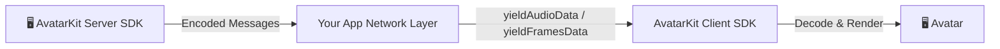

# Host Mode

[](https://www.npmjs.com/package/@spatialwalk/avatarkit)
[](https://github.com/spatialwalk/avatar-sdk-python)

Full server-side conversation pipeline where the backend handles the entire flow:

`ASR → LLM → TTS + Host Bridge`

The backend relays audio and animation data to clients via the Host Bridge. Supports multi-platform clients (Web, iOS, Android, Flutter).

## Architecture



1. Client sends audio to the backend
2. Backend runs ASR to transcribe speech
3. Transcription is processed by LLM
4. LLM response is converted to speech via TTS
5. Audio + animation data is relayed to the client through the Host Bridge
6. Client renders the lip-synced avatar

## Prerequisites

- Node.js 18+
- pnpm
- Python 3.10+
- uv
- [SpatialReal credentials](https://app.spatialreal.ai/apps)

## Setup

```bash
# Backend
cd servers/python
cp .env.example .env
uv sync

# Frontend
cd ../../clients/frontend
cp .env.example .env
pnpm install
```

Fill both `.env` files with real values.

## Run

```bash
# Terminal 1 — Backend
cd servers/python
uv run app.py
```

```bash
# Terminal 2 — Frontend
cd clients/frontend
pnpm dev
```

Open `http://localhost:3002`.

## Project Structure

```text
host-mode/
├── clients/
│   ├── frontend/         # Web client (JS)
│   ├── ios/              # Placeholder
│   ├── android/          # Placeholder
│   └── flutter/          # Placeholder
├── servers/
│   ├── python/           # Full host pipeline implementation
│   ├── nodejs/           # Placeholder
│   └── go/               # Placeholder
└── README.md
```

> **Note:** `servers/nodejs`, `servers/go`, and mobile clients are placeholders. Use `servers/python` + `clients/frontend` for a runnable demo.

## References

- [AvatarKit Host Mode Guide](https://docs.spatialreal.ai/guide/host-mode)
- [Get API Keys](https://docs.spatialreal.ai/overview/get-apikeys)
- [Test Avatars](https://docs.spatialreal.ai/overview/test-avatars)
- [Regions & Endpoints](https://docs.spatialreal.ai/overview/regions)
