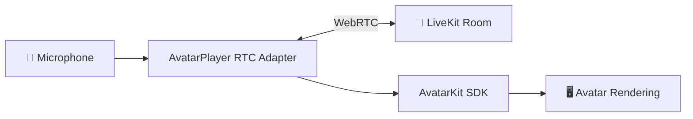

# RTC Mode

[](https://www.npmjs.com/package/@spatialwalk/avatarkit)
[](https://www.npmjs.com/package/@spatialwalk/avatarkit-rtc)

Standalone RTC room connectivity validation without agent dispatch. Use this demo to verify your LiveKit + SpatialReal RTC setup before building a full voice agent.

## Architecture



1. Backend issues a LiveKit token and creates a room
2. Frontend joins the room and establishes an RTC connection
3. SpatialReal avatar stream is rendered — no agent or conversation pipeline involved

## Prerequisites

- Node.js 18+
- pnpm
- Python 3.10+
- uv
- [LiveKit Cloud credentials](https://cloud.livekit.io) (or self-hosted)
- [SpatialReal credentials](https://app.spatialreal.ai/apps)

## Setup

```bash
# Backend
cd servers/python
cp .env.example .env
uv sync

# Frontend
cd ../../clients/frontend
cp .env.example .env
pnpm install
```

Fill both `.env` files with real values.

## Run

```bash
# Terminal 1 — Token server
cd servers/python
uv run token_server.py
```

```bash
# Terminal 2 — Frontend
cd clients/frontend
pnpm dev
```

Open `http://localhost:3003`.

## Project Structure

```text
rtc-mode/
├── clients/
│   └── frontend/
│       ├── .env.example
│       ├── index.html
│       ├── package.json
│       ├── vite.config.ts
│       └── src/
│           ├── App.tsx
│           └── main.tsx
├── servers/
│   └── python/
│       ├── .env.example
│       ├── pyproject.toml
│       └── token_server.py
└── README.md
```

## References

- [AvatarKit RTC Mode Guide](https://docs.spatialreal.ai/guide/rtc-mode)
- [Get API Keys](https://docs.spatialreal.ai/overview/get-apikeys)
- [Test Avatars](https://docs.spatialreal.ai/overview/test-avatars)
- [Session Token Guide](https://docs.spatialreal.ai/server/auth)
- [LiveKit Cloud](https://cloud.livekit.io/)
