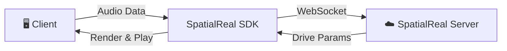

# SDK Mode

[](https://www.npmjs.com/package/@spatialwalk/avatarkit)

In SDK mode the entire conversation pipeline runs on the client:

`ASR → LLM → TTS → Avatar`

The backend only issues a `session token`.

## Architecture



1. Local VAD detects speech and segments audio
2. Segment is sent to ASR for transcription
3. ASR text streams into LLM
4. LLM deltas are split into sentence chunks
5. Each chunk triggers TTS immediately
6. Audio is sent to Avatar in strict chunk index order
7. Only the last chunk uses `flush=true`

**Key constraints:**

- Strict send order for chunked TTS output
- Flush only once at the end of one full reply
- Use SDK `onConversationState` as the speaking state source
- Gate VAD while avatar is speaking or processing
- Prefer natural punctuation boundaries for chunking

## Prerequisites

- Node.js 18+
- pnpm
- Python 3.10+
- uv
- [SpatialReal credentials](https://app.spatialreal.ai/apps)
- OpenAI API key (for the Web reference client)

## Setup

Start token service:

```bash
cd servers/python
cp .env.example .env
uv sync
```

Start web client:

```bash
cd clients/web
cp .env.example .env
pnpm install
```

Fill both `.env` files with real values.

### Environment Variables

Web (`clients/web/.env`):

- `VITE_SPATIALREAL_APP_ID`
- `VITE_SPATIALREAL_AVATAR_ID`
- `VITE_OPENAI_API_KEY`
- `VITE_OPENAI_MODEL`
- `VITE_OPENAI_STT_MODEL`
- `VITE_OPENAI_TTS_MODEL`
- `VITE_OPENAI_TTS_VOICE`
- `VITE_VAD_START_THRESHOLD`
- `VITE_VAD_STOP_THRESHOLD`
- `VITE_VAD_SILENCE_MS`
- `VITE_VAD_MIN_SPEECH_MS`

Backend (`servers/*/.env`) must provide SpatialReal credentials for token issuing.

## Run

```bash
# Terminal 1 — Token service
cd servers/python
uv run app.py
```

```bash
# Terminal 2 — Web client
cd clients/web
pnpm dev
```

Open `http://localhost:3001`.

## Project Structure

```text
sdk-mode/
├── clients/
│   ├── web/              # Main Web SDK mode sample (React)
│   ├── ios/
│   └── android/          # Kotlin + Compose sample
├── servers/
│   ├── python/           # Recommended token service
│   ├── nodejs/           # Placeholder
│   └── go/               # Placeholder
└── README.md
```

## Production Notes

- Direct model calls from client are for demos only.
- Production should proxy model calls on backend and store secrets server-side.
- Add auth, rate limiting, audit logs, and retry strategy.

## References

- [AvatarKit SDK Mode Guide](https://docs.spatialreal.ai/guide/sdk-mode)
- [Get API Keys](https://docs.spatialreal.ai/overview/get-apikeys)
- [Test Avatars](https://docs.spatialreal.ai/overview/test-avatars)
- [Session Token Guide](https://docs.spatialreal.ai/server/auth)
