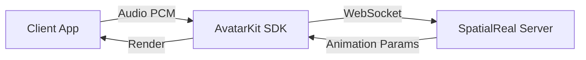

# SDK Mode

[](https://www.npmjs.com/package/@spatialwalk/avatarkit)

## When to use SDK Mode

SDK Mode is for scenarios where **the client drives the avatar directly** — your app sends audio data to SpatialReal's server, which returns animation parameters for lip-synced avatar rendering. The entire conversation pipeline (ASR, LLM, TTS) is your responsibility to implement wherever you prefer (client-side, your own backend, or a third-party service).

**Choose SDK Mode when:**
- You want full control over the conversation pipeline
- You already have your own ASR/LLM/TTS infrastructure
- You want to integrate AvatarKit into an existing app

**Choose [Host Mode](../host-mode/) when:**
- You want a turnkey server-side pipeline (backend handles ASR → LLM → TTS → Avatar)
- You want to keep API keys and AI logic on the server
- You need to support thin clients that only render

## Architecture



## Prerequisites

- [SpatialReal credentials](https://app.spatialreal.ai/apps) (App ID + Session Token)

## Quick Start

### Web (React)

```bash
cd clients/web/react
pnpm install
pnpm dev
```

Open `http://localhost:5173`, enter your App ID and Session Token, select a character, and click an audio file to see the avatar speak.

Other frameworks available: `vue/`, `vanilla/`, `nextjs-direct/`, `nextjs-iframe/`.

### Android

Open `clients/android/` in Android Studio. Enter App ID and Session Token on the config screen, select a character, and tap an audio file.

### iOS

```bash
cd clients/ios
xcodegen generate
```

Open `AvatarDemo.xcodeproj` in Xcode. Enter App ID and Session Token, select a character, and tap an audio file.

## Project Structure

```text
sdk-mode/
├── clients/
│   ├── web/
│   │   ├── react/
│   │   ├── vue/
│   │   ├── vanilla/
│   │   ├── nextjs-direct/
│   │   └── nextjs-iframe/
│   ├── android/          # Kotlin + Compose
│   └── ios/              # SwiftUI
└── README.md
```

## Extending with Real-Time Conversation

These demos use pre-recorded audio files to drive the avatar. To build a full voice conversation, replace the audio source with your own AI pipeline:

```typescript
// Instead of loading a PCM file:
const pcm = await yourTTS.synthesize(text)
controller.send(pcm.buffer, true)
```

## References

- [AvatarKit SDK Mode Guide](https://docs.spatialreal.ai/guide/sdk-mode)
- [Get API Keys](https://docs.spatialreal.ai/overview/get-apikeys)
- [Test Avatars](https://docs.spatialreal.ai/overview/test-avatars)
- [Session Token Guide](https://docs.spatialreal.ai/server/auth)
