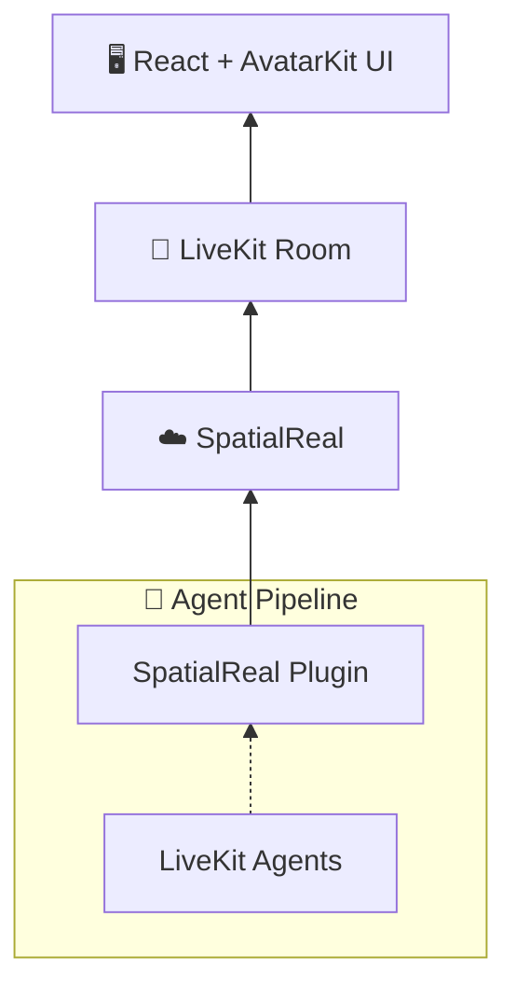

# SpatialReal Agent Quickstart

[](https://www.npmjs.com/package/@spatialwalk/avatarkit)
[](https://www.npmjs.com/package/@spatialwalk/avatarkit-rtc)
[](https://ui.spatialreal.ai/)
[](https://pypi.org/project/livekit-plugins-spatialreal/)

End-to-end voice agent quickstart with a React frontend (AvatarKit UI) and a LiveKit Agents backend powered by Gemini Live + SpatialReal avatar.

## Architecture



1. Frontend requests `/token` from backend
2. Backend returns LiveKit JWT and dispatches `voice-assistant`
3. Agent worker joins room and starts Gemini Live + SpatialReal avatar session
4. Frontend connects to LiveKit and renders avatar with `SpatialRealAvatarProvider`

## Prerequisites

- Node.js 18+
- pnpm
- Python 3.10+
- uv
- [LiveKit Cloud credentials](https://cloud.livekit.io)
- [Google Gemini API key](https://aistudio.google.com/api-keys)
- [SpatialReal credentials](https://app.spatialreal.ai/apps)

## Setup

```bash
cp backend/.env.example backend/.env
cp frontend/.env.example frontend/.env
```

Fill both `.env` files with real values.

Install dependencies:

```bash
# Backend
cd backend
uv sync

# Frontend
cd ../frontend
pnpm install
```

## Run

Use 3 terminals:

```bash
# Terminal 1 — Token server
cd backend
uv run token_server.py
```

```bash
# Terminal 2 — Agent worker
cd backend
uv run agent.py dev
```

```bash
# Terminal 3 — Frontend
cd frontend
pnpm dev
```

Open `http://localhost:3000`, click **Connect**, then **Start Mic**.

## Project Structure

```text
spatialreal-agent-quickstart/
├── backend/
│   ├── .env.example
│   ├── agent.py
│   ├── pyproject.toml
│   └── token_server.py
└── frontend/
    ├── .env.example
    ├── index.html
    ├── package.json
    └── src/
        ├── App.tsx
        ├── main.tsx
        ├── hooks/
        │   └── useSpatialRealAvatar.ts
        ├── types/
        │   └── spatialreal-avatar.ts
        └── components/
            ├── spatialreal-avatar/
            └── ui/
```

## References

- [AvatarKit RTC Mode Guide](https://docs.spatialreal.ai/guide/rtc-mode)
- [Get API Keys](https://docs.spatialreal.ai/overview/get-apikeys)
- [Test Avatars](https://docs.spatialreal.ai/overview/test-avatars)
