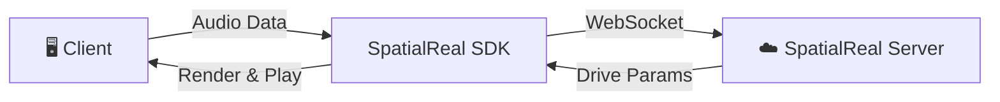

# SpatialReal Speech-to-Avatar Quickstart

[](https://www.npmjs.com/package/@spatialwalk/avatarkit)

Minimal Web quickstart for SpatialReal SDK mode. Connects an avatar and streams demo PCM audio with lip-sync — no agent or backend required.

## Architecture



1. User clicks **Connect Avatar** — client establishes a WebSocket session with SpatialReal
2. User clicks **Send Audio** — client fetches a fixed mono 16 kHz PCM file and streams it to the avatar
3. SpatialReal returns animation data; the client renders lip-synced playback in real time

## Prerequisites

- Node.js 18+
- pnpm
- SpatialReal credentials:
  - `VITE_SPATIALREAL_APP_ID` — [Get from Studio](https://app.spatialreal.ai/apps)
  - `VITE_SPATIALREAL_AVATAR_ID` — [Pick from Avatar Library](https://app.spatialreal.ai/avatars/library)
  - `VITE_SPATIALREAL_SESSION_TOKEN` — [Generate in Studio](https://app.spatialreal.ai/apps) ([Guide](https://docs.spatialreal.ai/studio/aki-key#temporary-session-token))

## Setup

```bash
pnpm install
cp .env.example .env
```

Fill `.env` with your own values.

## Run

```bash
pnpm dev
```

Open `http://localhost:3000`, click **Connect Avatar**, then click **Send Audio**.

## Project Structure

```text
spatialreal-speech-to-avatar-quickstart/
├── .env.example
├── index.html
├── package.json
├── vite.config.ts
└── src/
    ├── App.vue
    ├── main.ts
    └── style.css
```

## References

- [AvatarKit SDK Mode Guide](https://docs.spatialreal.ai/guide/sdk-mode)
- [Get API Keys](https://docs.spatialreal.ai/overview/get-apikeys)
- [Test Avatars](https://docs.spatialreal.ai/overview/test-avatars)
